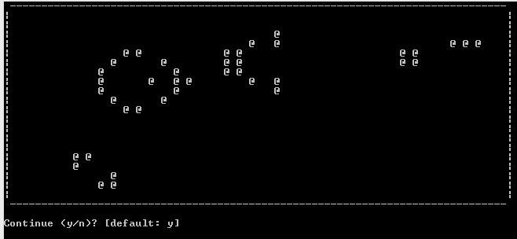

# conway-comonad

This project implements Conway's Game of Life (https://en.wikipedia.org/wiki/Conway%27s_Game_of_Life) using Haskell and the comonad class. The game is made from an infinite grid with bool values that tells if a cell is dead or alive, and is visualized on the command prompt.

This was just a toy project for me to understand more about comonads, so there is some room for improvements, such as optimization. For example, because the grid is infinite the memory usage is increased for each update until the process ends.
